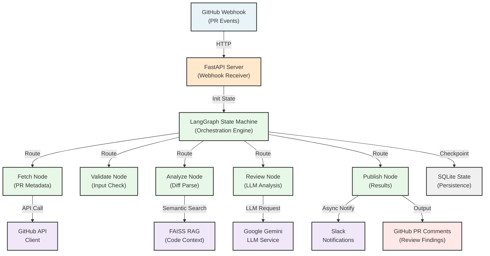
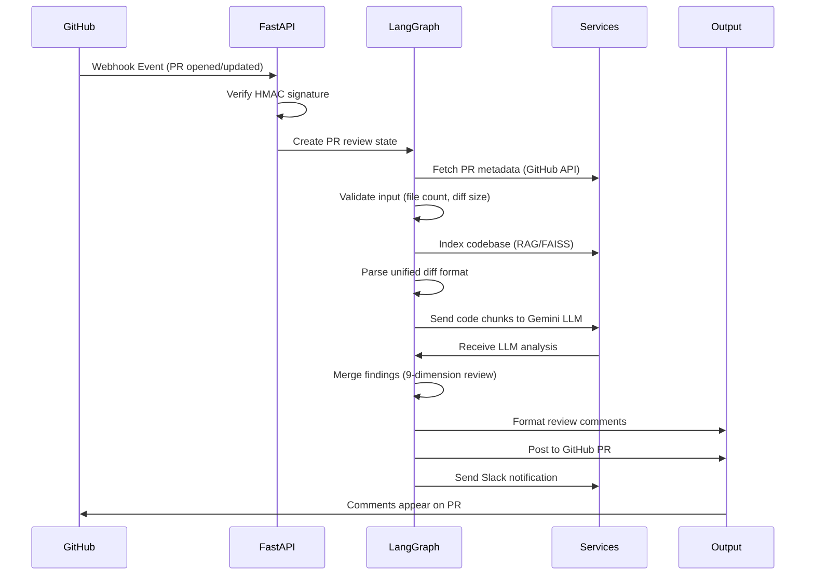
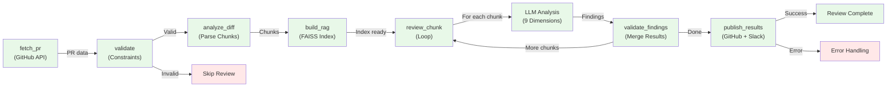
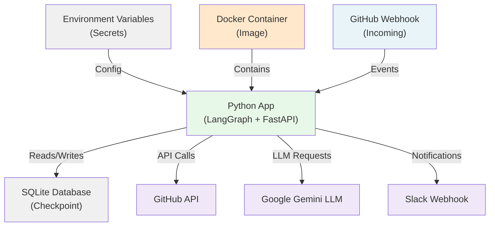
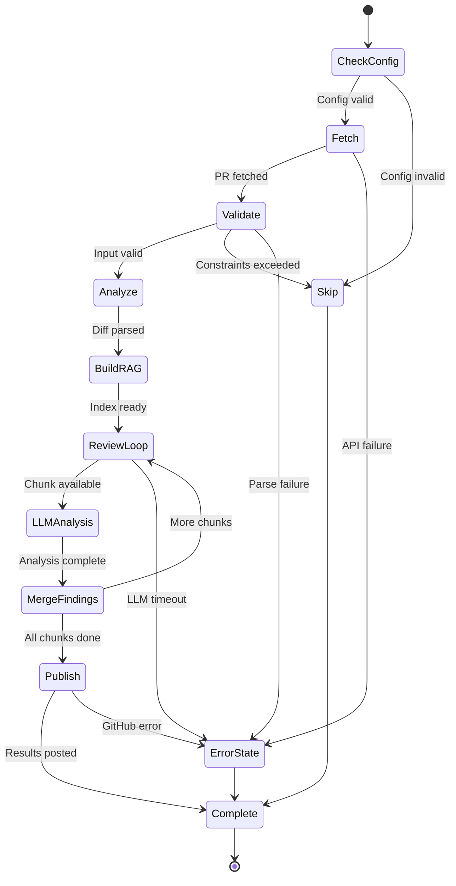
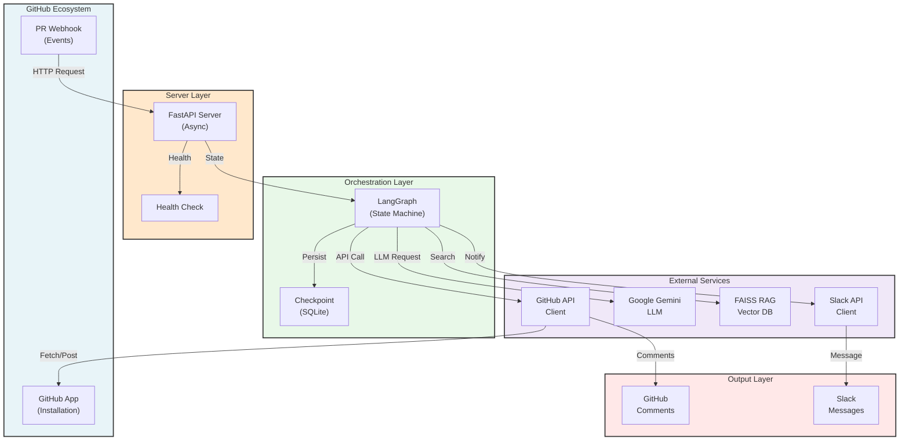

# Architecture Diagram - PR Review Agent

This file contains Mermaid diagrams for the PR Review Agent architecture. You can:
1. **View on GitHub** — Mermaid renders automatically
2. **Export to PNG** — Use [mermaid.live](https://mermaid.live)
3. **Use in docs** — Copy-paste into any markdown file

---

## System Architecture



---

## Data Flow Sequence



---

## LangGraph Node Flow



---

## Deployment Architecture



---

## State Machine Transitions



---

## Component Interaction Diagram



---

## How to Export to PNG

### Option 1: Use Mermaid Live Editor (Free, No Installation)
1. Go to [mermaid.live](https://mermaid.live)
2. Copy the diagram code from this file
3. Paste into the editor
4. Click **Download** → **PNG**

### Option 2: Use mermaid-cli (Local)
```bash
npm install -g @mermaid-js/mermaid-cli
mmdc -i ARCHITECTURE_DIAGRAM.md -o architecture.png
```

### Option 3: Use GitHub's Built-in Rendering
- GitHub automatically renders Mermaid diagrams in markdown
- Right-click → Save image as PNG

---

## Legend

| Color | Component Type |
|-------|-----------------|
| 🔵 Light Blue | External Inputs |
| 🟠 Light Orange | Server/API |
| 🟢 Light Green | Orchestration/Nodes |
| 🟣 Light Purple | External Services |
| 🔴 Light Red | Output/Results |
| ⚫ Gray | Persistence/Checkpoint |

---

**Generated**: 2026-04-13
**Version**: 1.0.0
**Framework**: LangGraph, FastAPI, FAISS RAG, Google Gemini
**Status**: Ready for Publication
